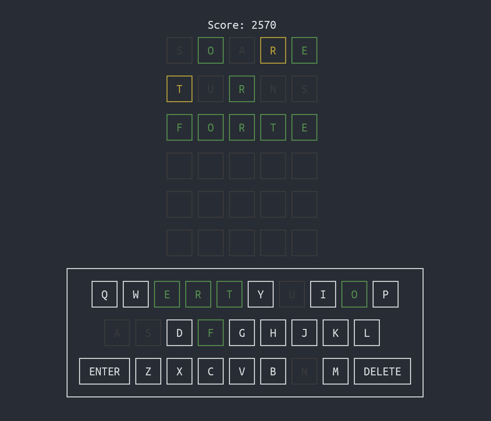

<div align="center">

# clidle

**Wordle, now over SSH.**



**Try it:**

```sh
ssh clidle.ddns.net -p 3000
```

**Or, run it locally:**

```sh
go install github.com/ajeetdsouza/clidle@latest
```

</div>

## How to play

You have 6 attempts to guess the correct word. Each guess must be a valid 5 letter
word.

After submitting a guess, the letters will turn green, yellow, or gray.

- **Green:** The letter is correct, and is in the correct position.
- **Yellow:** The letter is present in the solution, but is in the wrong position.
- **Gray:** The letter is not present in the solution.

## Scoring

Your final score is based on how many guesses it took to arrive at the solution:

| Guesses | Score |
| ------- | ----- |
| 1       | 100   |
| 2       | 90    |
| 3       | 80    |
| 4       | 70    |
| 5       | 60    |
| 6       | 50    |
